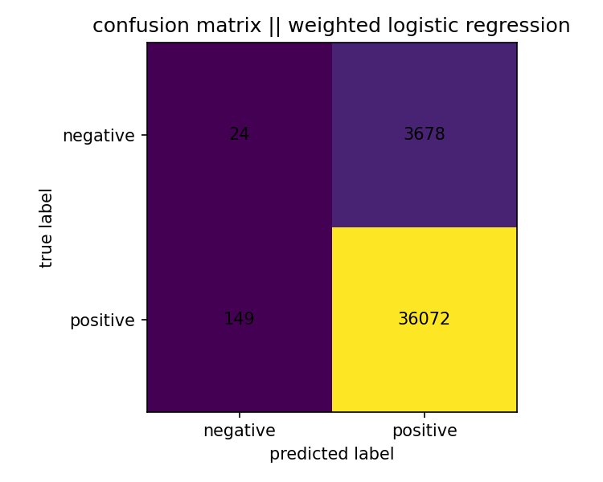

# steam review sentiment analysis (ml)

## overview

- a personal project used to explore sentiment classification on steam game reviews.
- focus on:
  -- text features
  -- class imbalance
  -- model evaluation

## dataset

dataset is not included in repo due to size

to reproduce:

1. download dataset: https://www.kaggle.com/datasets/andrewmvd/steam-reviews
2. put csv into 'data/raw/'
3. run notebooks in order

fields used:

- 'review_text'
- 'review_score' {-1, 1}

## approach

1. data exploration
2. tf-idf text features
3. logistic regression baseline (default positive)
4. class weighting to adjust imbalance
5. result evaluation (accuracy not reliable. used confusion matrices and f1-score)

## outcome

- ~94% accuracy
- macro f1 improved with class weighting
- precision dropped to gain stronger negative recall

## limitations

- data imbalance
- short / not genuine reviews
- public sourced reviews include lots of sarcasm and noise
